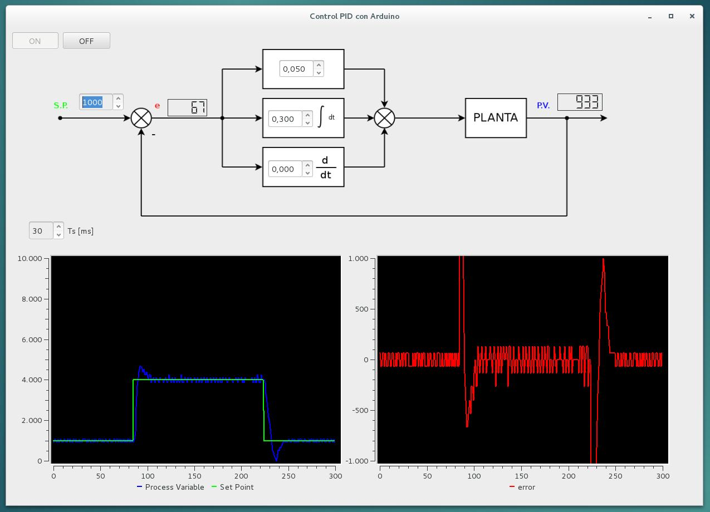
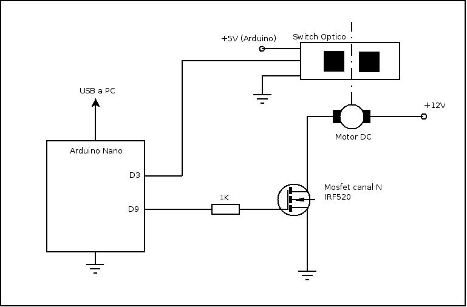
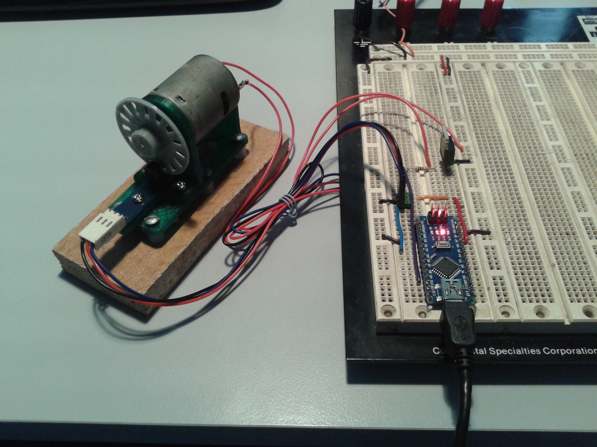

Control PID 
===========

Implementacion de un control PID en Arduino y una GUI (en Python)   
para el ajuste interactivo de los parametros de ganancia y muestreo. 

Paquetes necesarios :

* python 2.7
* python-qt4
* python-qwt5-qt4
* python-serial
* arduino

