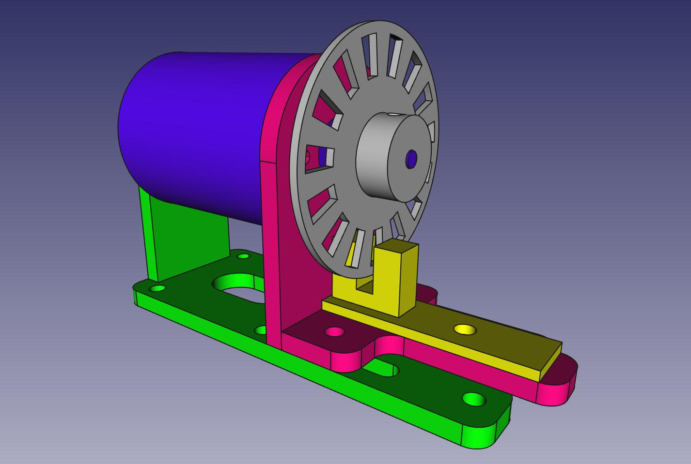

Control PID 
===========

Implementacion de un control PID en Arduino y una GUI (en Python)   
para el ajuste interactivo de los parametros de ganancia y muestreo. 

Paquetes necesarios :

* python 2.7
* python-qt4
* python-qwt5-qt4
* python-serial
* arduino

Circuito :

Nota : 
La unica ventaja de este driver, con un solo transistor, es su 
simpleza, ya que produce una asimetria en el control al no
poder invertir la polaridad del motor.

Soporte del motor : 

El soporte tambien esta en [thingiverse](www.thingiverse.com/thing:1643604)

